## Flow-NMS：基于Gin+Vue的中小型网络流量监控系统

## 简介
适用于中小型网络环境，可采集网络设备的 NetFlow/sFlow 流量数据进行存储展示。  
注：毕业设计，于 2022-05-04 初步完成，已可用于小型网络环境。遗憾的是，后续因工作繁忙没时间继续维护，没能让这个作品变得更完美，更易部署

## 处理流程
pmacct 采集数据后打到 Kafka 集群，Clickhouse_Sinker_Nali 中间件实时消费 Kafka 数据进行 GeoIP 查询及特定处理后，写到 Clickhouse 集群。后端定时聚合各项指标（热点查询数据）后写入 Redis 供前端用户查询。
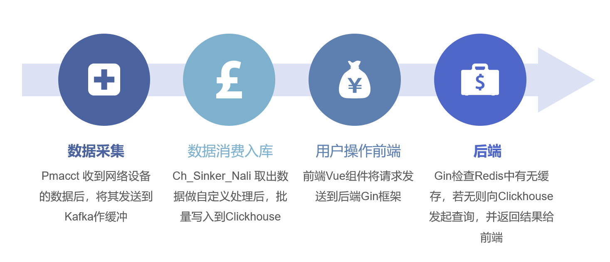 

## 整体架构
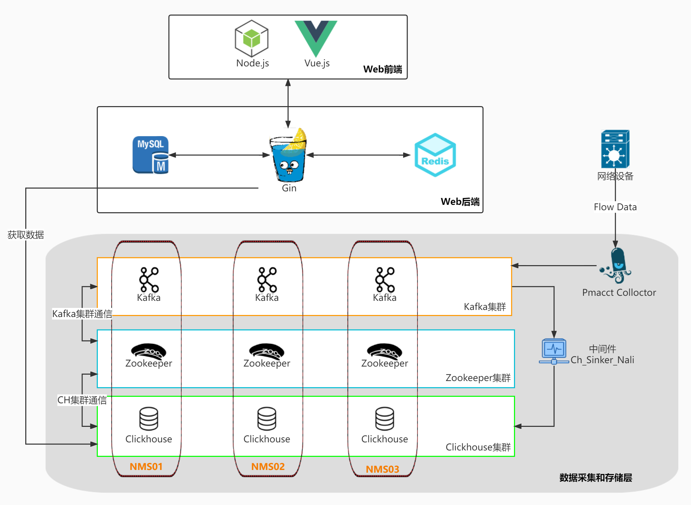

## 组件介绍
- 开发框架：[gin-vue-admin v2.4.5](https://github.com/flipped-aurora/gin-vue-admin/tree/v2.4.5) (commit date: 2021-11-09)
- 前端：Vue.js 3
- 后端：Gin + Gorm
- 数据库：
    - MySQL（用户信息存储）
    - Clickhouse 3节点集群（流数据存储）
    - Redis（缓存用户查询的热点数据）
- 中间件：
    - Kafka（流数据消息队列）
    - Zookeeper（Kafka&Ck 集群协调）
    - [Clickhouse_Sinker_Nali](https://github.com/forever765/clickhouse_sinker_nali)（基于Clickhouse_Sinker修改，用于数据清洗和预处理）
- 健康检查工具： zookeeper-healthcheck、kafka-health-check

## 核心功能展示
#### 首页看板：展示四项核心数据、一小时内流量图  
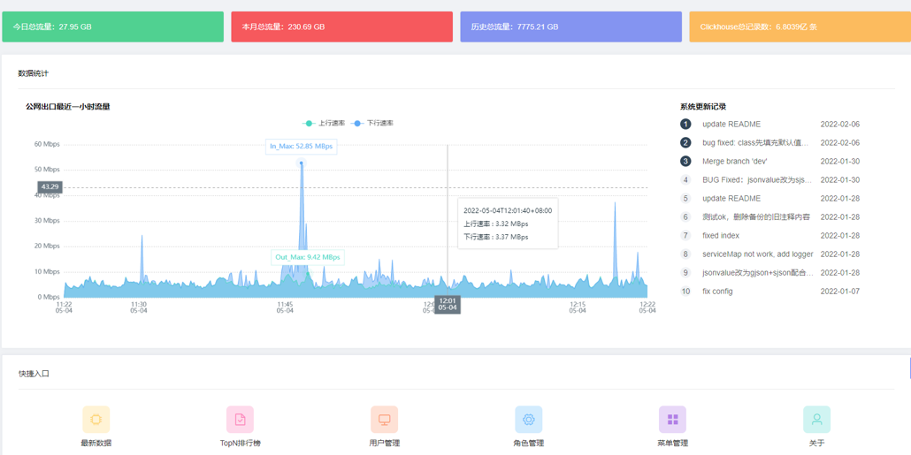 

#### 报表展示
- 最新数据：展示当前Ck中的最新流量数据
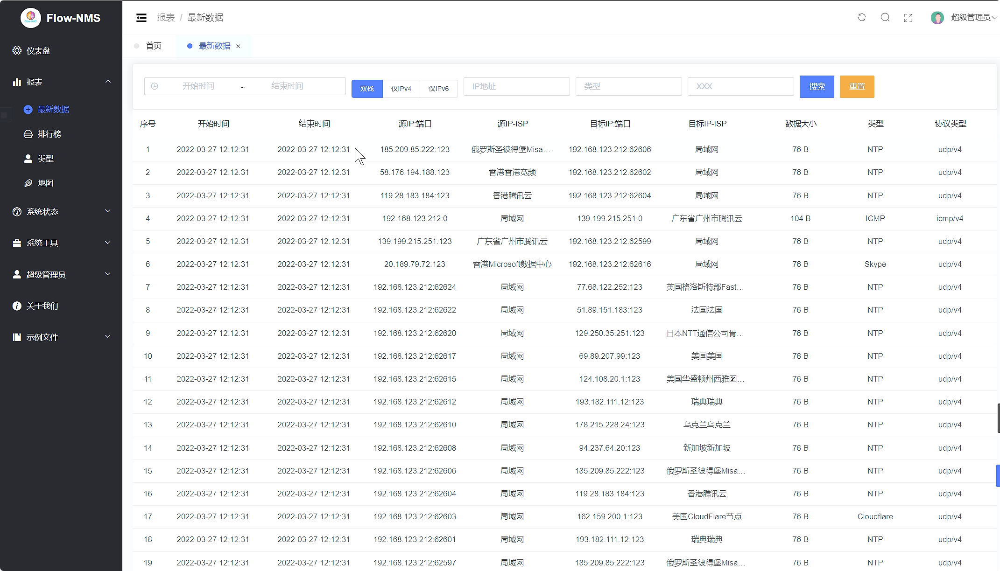 

- 排行榜：展示指定条件的TopN数据（datetime & protocol & src/dst ip）
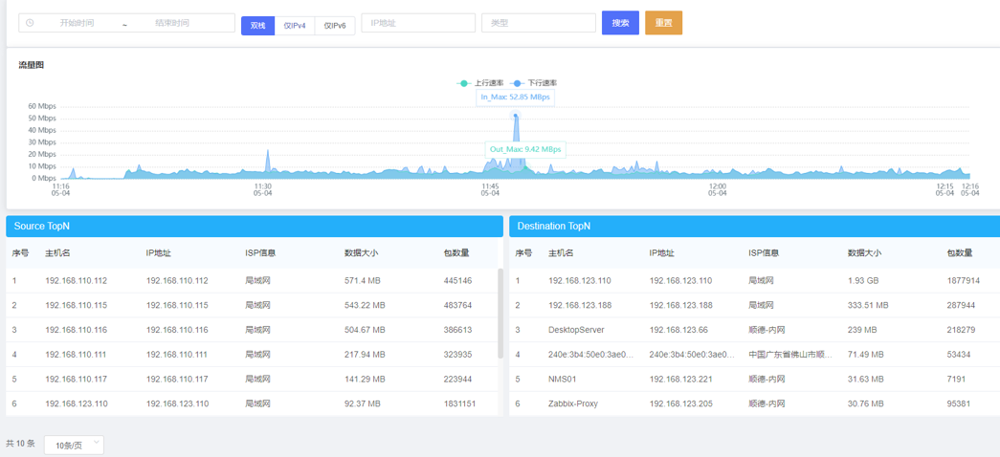 

#### 系统工具
- IP-Hosts 关系维护（用于设备IP 信息标注）
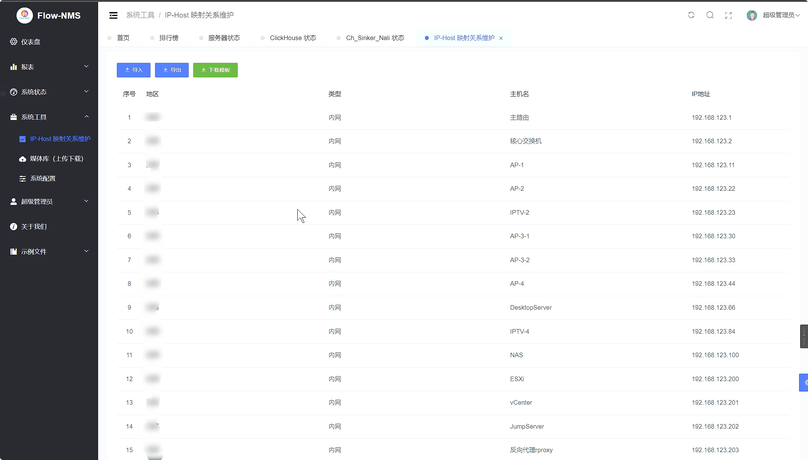 

- 系统配置（各组件连接信息等）
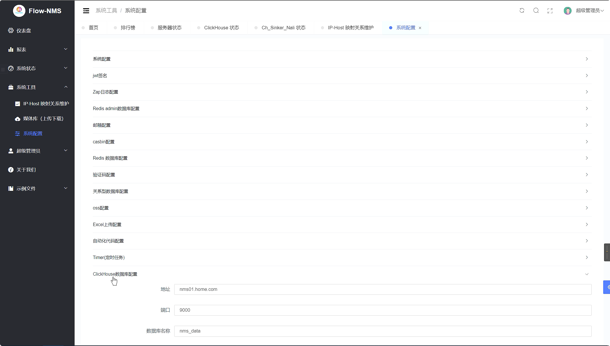 

#### 系统状态监控
- 服务器状态
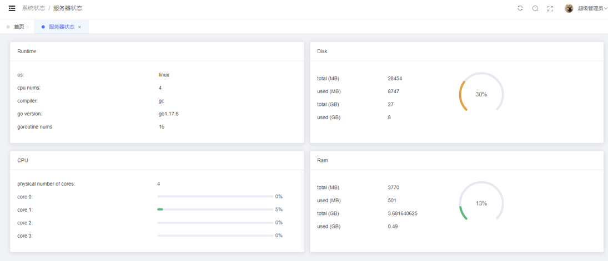 
- Clickhouse 状态
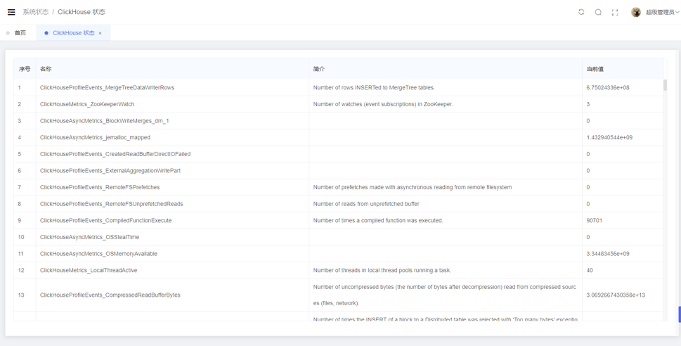 
- Sinker 状态
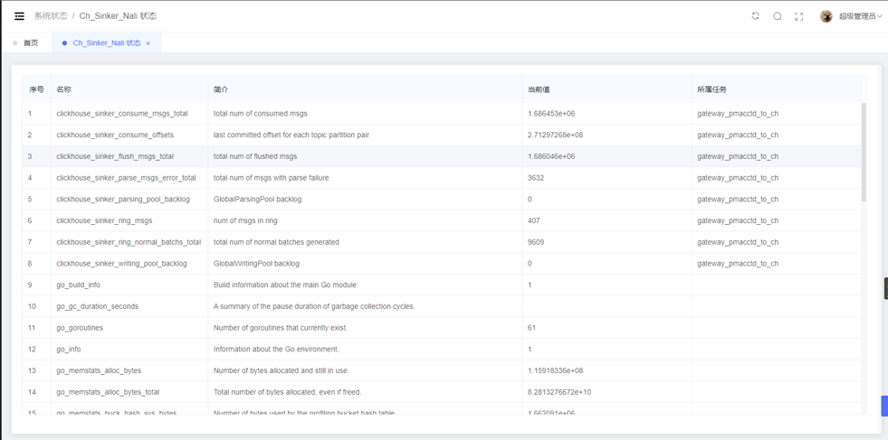 
- Kafka&Zk 状态
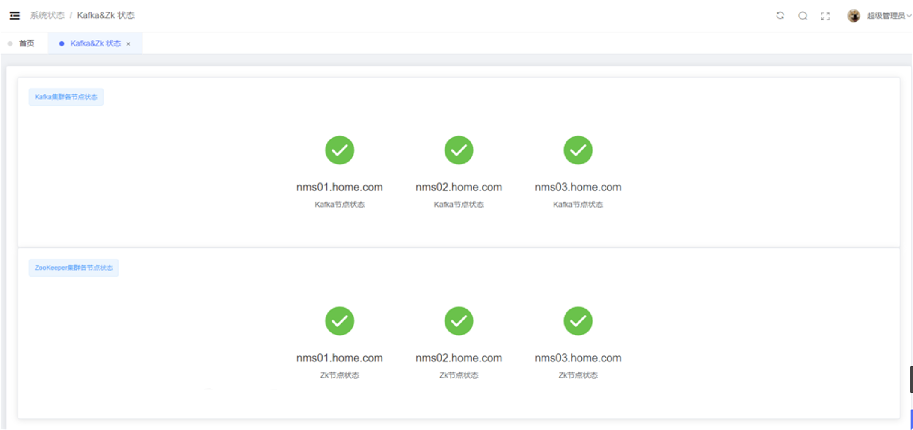 
